# Flow Of Control

## 1. Login

You can Login using existing credentials or Forget Password if lost.

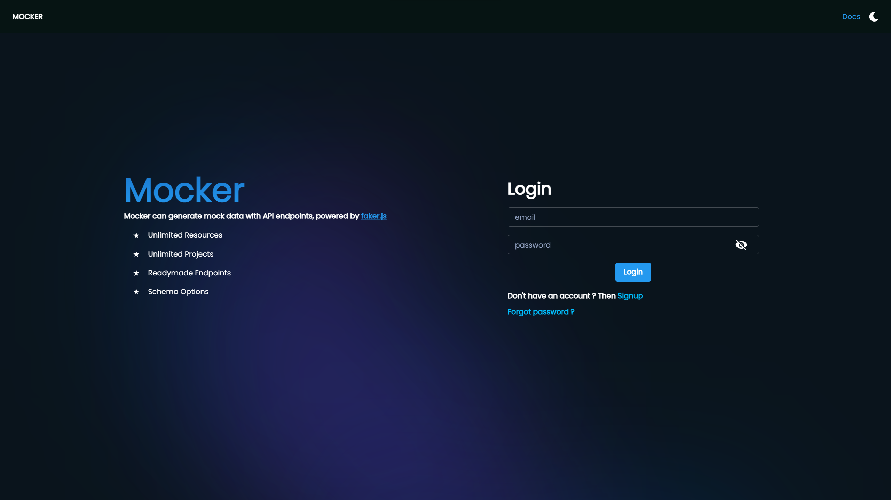

## 2. Signup

Create New Account

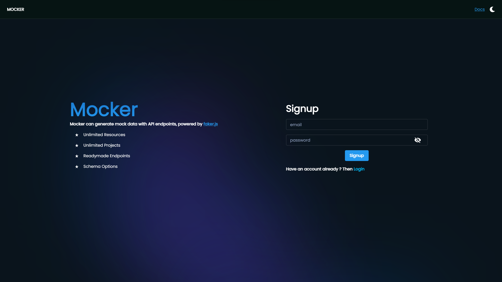

## 3. Forget Password

Enter Email if you forgot password

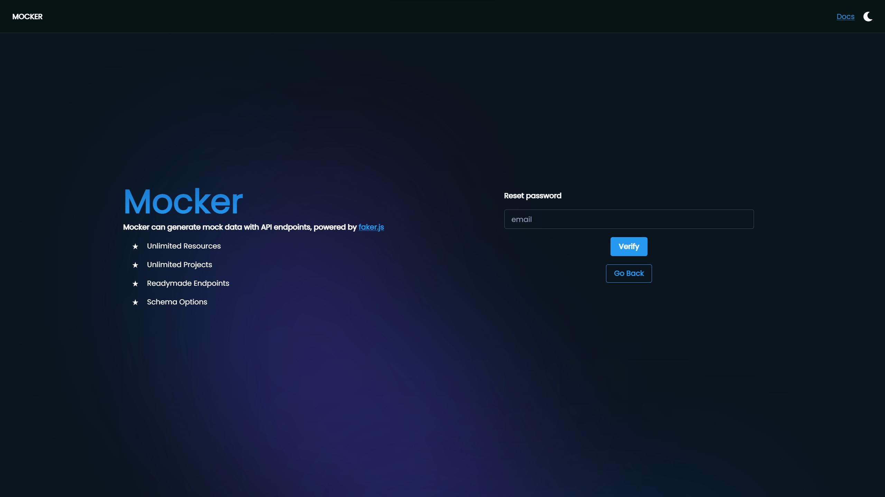

## 4. Verify Email

Verify Email else the toast will appear on using Login

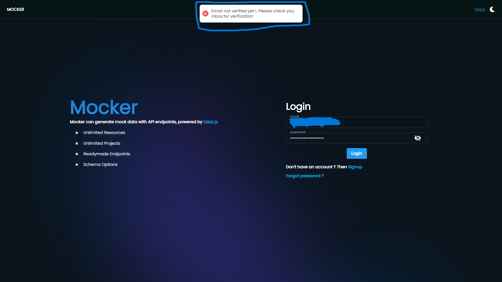

## 5. Projects Page

Create new Project here

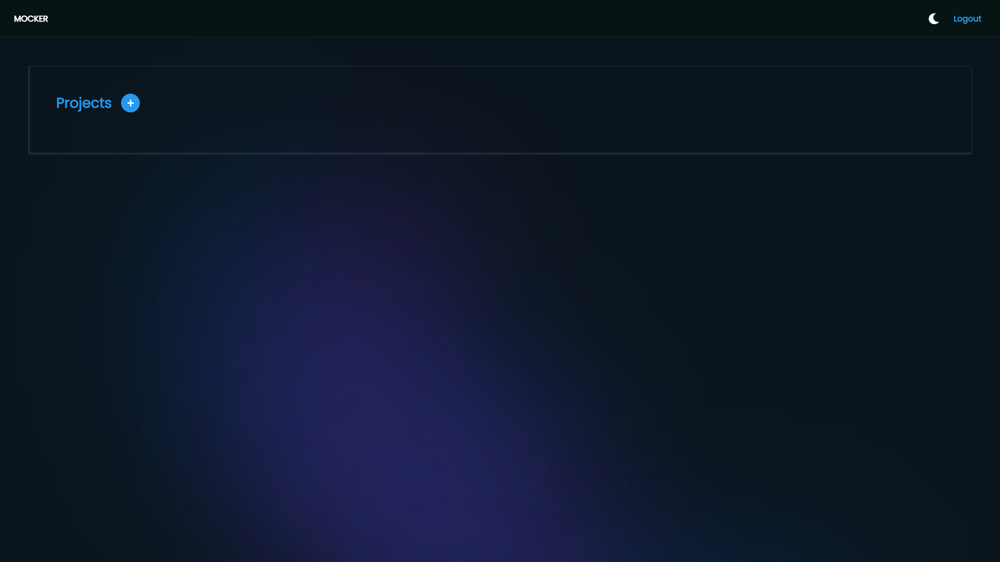

## 6. Create New Project

Enter project name and click on "Create"

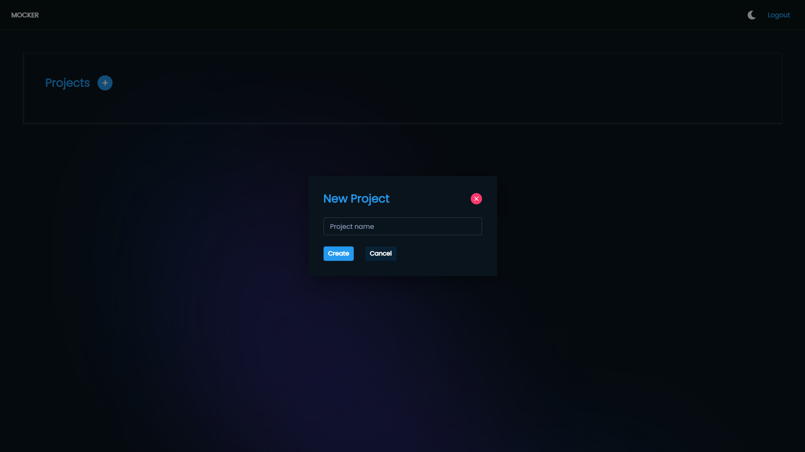

## 7. Updated Project page

Created Projects will appear here

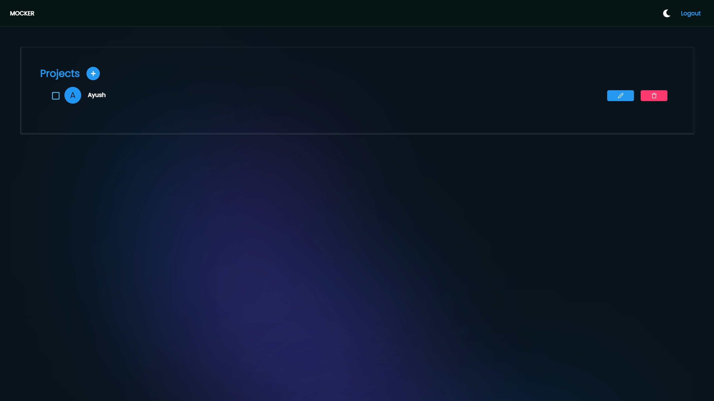

## 8. Resource Page

Created resources will appear here

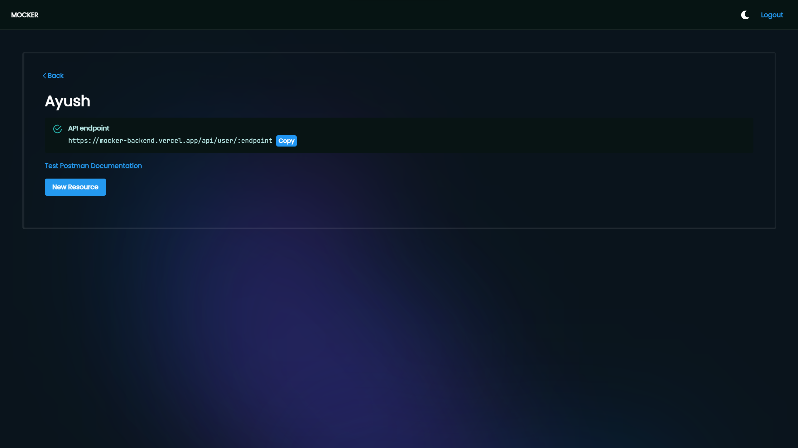

## 9. Create New Resource

You can create new resources

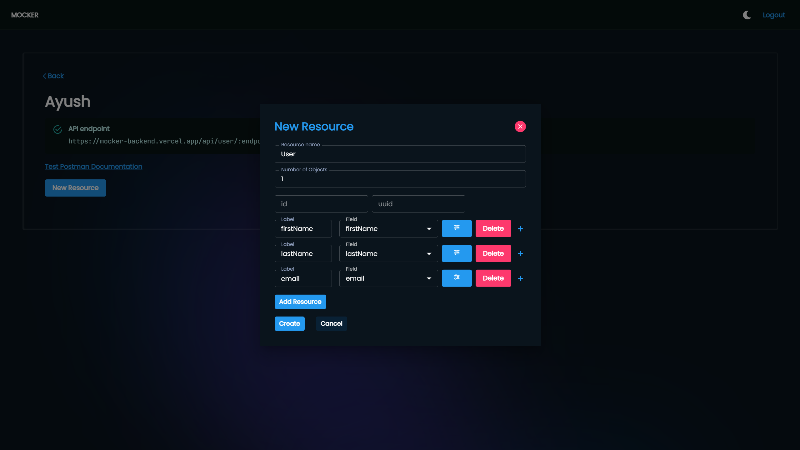

## 10. Resources endpoints

Endpoints of create resources using different methods will appear here

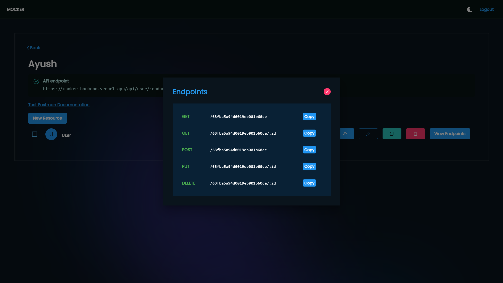

## 11. API Preview

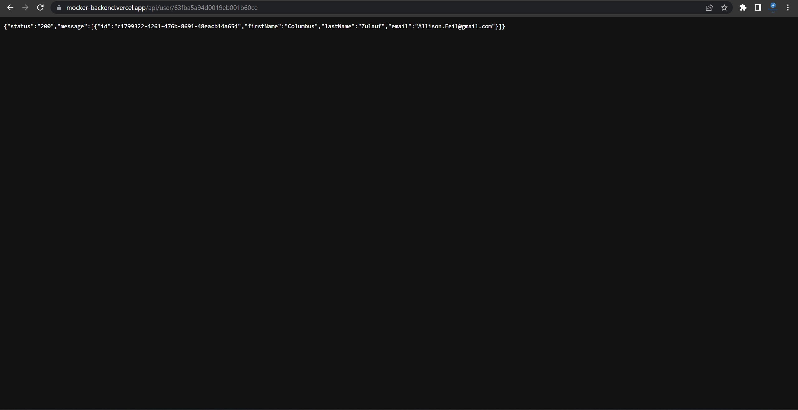

## 12. API Results

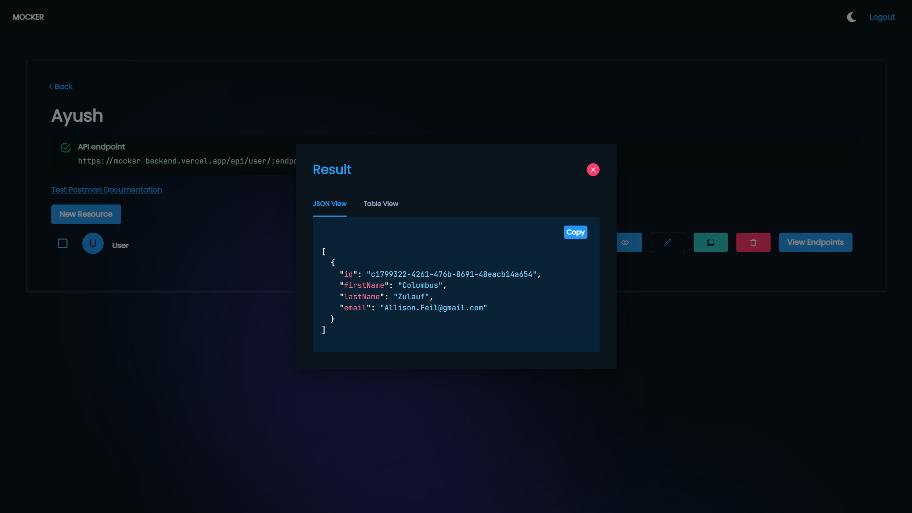

